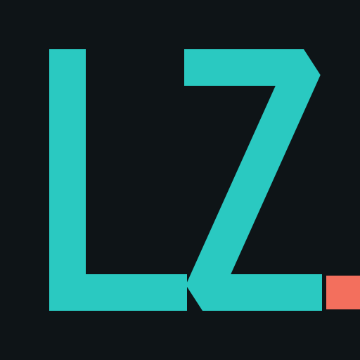

<p align="center">
  
</p>

<p align="center">
  <a href="https://github.com/Linxira-OS/linxira-zeta/releases"></a>
  
  
  
  <a href="https://github.com/Linxira-OS/linxira-zeta/actions"></a>
</p>

Zeta is a Bun-native coding agent distribution built on the OMP runtime. It

Zeta is a Bun-native coding agent distribution built on the OMP runtime. It
keeps the terminal workflow fast and direct while owning its package namespace,
product presentation, release policy, and future local web workspace.

## Update Log

Release history (v1.0.9 and earlier): [UPDATE-LOG.md](UPDATE-LOG.md)

## Start Here

From a source checkout:

```sh
bun install
bun run build:native
bun run dev
```

The CLI opens in the current project directory. Use `bun run dev -- --help` to
inspect commands and options.

Windows native builds require Visual Studio Build Tools with the Desktop
development with C++ workload. On macOS and Linux, use the platform C/C++
toolchain required by Rust.

## What Zeta Provides

- A terminal coding workspace with file reading, search, patching, shell, git,
  task delegation, and structured tool output.
- Multi-provider model access, local configuration, OAuth flows, model
  discovery, session recovery, and controllable retry behavior.
- Native text, image, terminal, browser, and desktop capabilities where the
  host platform supports them.
- A Bun-first monorepo with internal packages under the `@linxiraos/*` namespace.
- A planned local web workbench and desktop distribution that use the same
  coding-agent runtime rather than a separate product stack.

## Upstream Origins

Zeta is a distribution derived from four upstream projects, each with a
fixed role:

| Project | Role in Zeta |
|---|---|
| [OMP (oh-my-pi)](https://github.com/can1357/oh-my-pi) | The runtime tree. Integrated only at complete, official release tags — never raw upstream commits |
| [Pi](https://github.com/earendil-works/pi) | Semantic-port source for feature work, never a raw merge source |
| [OMP Web](https://github.com/17380936778/omp-web) | Source of the `web-ui/` snapshot |
| [Pi Web](https://github.com/agegr/pi-web) | Semantic-port source for web features |

The merge policy is recorded in [document/upstream-sync.md](document/upstream-sync.md);
the web workbench's own front door is [web-ui/README.md](web-ui/README.md).
Predecessor contributions remain acknowledged in source history and package
notices.

## Zeta-Originated Capabilities

Beyond the OMP runtime lineage, Zeta ships its own capabilities (roadmap in
[document/roadmap.md](document/roadmap.md)):

- **Adaptive long-term tracking** — ongoing session observation with standing
  system guidance that keeps provider prefix caches stable across long
  sessions.
- **Experiment measurement** — per-project local experiment tracking with
  metrics, directions, and baseline commits.
- **TypeScript custom commands** — user-defined slash commands from
  `~/.zeta/commands/` and project command dirs, with `arktype`/`typebox`/`zod`
  argument schemas and full access to the runtime API.
- **Command marketplace** — install and share slash commands as Bun packages.
- **ACP collaboration builtins** — Agent Client Protocol session support.
- **Local stats dashboard** — `omp stats` observability for the coding agent.

## Documentation

The repository keeps two documentation trees with different audiences:

- [docs/](docs/) — **runtime documentation**, packaged with the product. Agents
  read it at runtime through `omp://docs/` (embedded in binaries and the npm
  bundle; from a source checkout it reads the live tree). Covers tools,
  tool-call conversion, skills, protocols, configuration, and Zeta features.
- [document/](document/) — **internal development and product-process
  documentation**, never packaged. Includes the [development
  roadmap](document/roadmap.md), the upstream [sync
  ledger](document/upstream-sync.md), and the
  [porting guide](document/porting-from-pi-mono.md).

## Development

```sh
# Static checks for TypeScript and Rust
bun check

# Coding-agent checks only
bun --cwd=packages/coding-agent run check

# Focused tests
bun --cwd=packages/coding-agent test test/<file>.test.ts
```

The primary application lives in `packages/coding-agent/`. Shared runtime
packages include `packages/ai/`, `packages/catalog/`, `packages/agent/`,
`packages/tui/`, and `packages/natives/`.

## Upstream Policy

Zeta follows OMP only through complete, official release tags. Each release is
merged as real Git history on a temporary integration branch, then receives any
required Zeta package, brand, Bun, CI, and product adaptations in separate
commits. The exact source tag, SHA, conflict decisions, and checks are recorded
in [document/upstream-sync.md](document/upstream-sync.md).

Pi and Pi Web are semantic feature sources, not raw merge sources. See
[AGENTS.md](AGENTS.md) for the repository rules.

## License

Zeta is distributed under the repository's [MIT License](LICENSE). Its runtime
lineage includes OMP and Pi; their contributions remain acknowledged in source
history and package notices.
