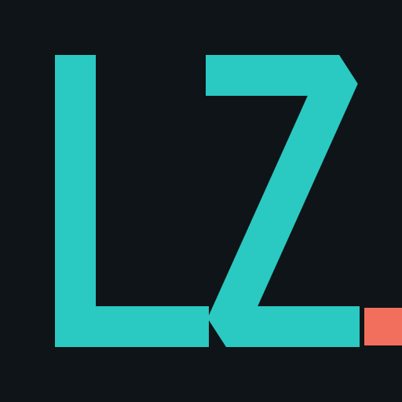

<p align="center">
  
</p>

<p align="center">
  <a href="https://github.com/Linxira-OS/linxira-zeta/releases"></a>
  
  
  
  <a href="https://github.com/Linxira-OS/linxira-zeta/actions"></a>
</p>

Zeta is a Bun-native coding agent distribution built on the OMP runtime. It
keeps the terminal workflow fast and direct while owning its package namespace,
product presentation, release policy, and its own local web workspace — one
runtime, three surfaces (terminal, browser, desktop).

## Update Log

Release history (v1.0.9 and earlier): [UPDATE-LOG.md](UPDATE-LOG.md)

## Start Here

Install the released CLI (Node 20+ or Bun on the machine):

```sh
npm i -g @linxiraos/zeta      # or: bun add -g @linxiraos/zeta
zeta-c                           # opens in the current project directory
zeta-c --help                    # commands and options
```

The bundled editor ships as its own package:

```sh
npm i -g @linxiraos/editor
zeta-editor .                  # launch in any terminal, including over SSH
```

From a source checkout:

```sh
bun install
bun run build:native
bun run dev
```

The CLI opens in the current project directory. Use `bun run dev -- --help` to
inspect commands and options.

Windows native builds require Visual Studio Build Tools with the Desktop
development with C++ workload. On macOS and Linux, use the platform C/C++
toolchain required by Rust.

## What Zeta Provides

- A terminal coding workspace with file reading, search, patching, shell, git,
  task delegation, and structured tool output.
- A bundled terminal editor ([TTT Editor](https://github.com/eugenioenko/ttt),
  vendored and maintained as `@linxiraos/editor`): install `npm i -g @linxiraos/editor`
  and launch `zeta-editor` in any terminal — including over SSH, so an agent
  session, hand-written edits, and code review all run on the server without a
  GUI editor. Windows x64 and Linux x64 builds ship as platform packages.
- Multi-provider model access, local configuration, OAuth flows, model
  discovery, session recovery, and controllable retry behavior.
- Native text, image, terminal, browser, and desktop capabilities where the
  host platform supports them.
- A Bun-first monorepo with internal packages under the `@linxiraos/*` namespace.
- A local web workbench (`zeta-c serve`, Next.js app in `web-ui/`) and a desktop
  shell (`zeta-desktop`, Electron) that embed the same coding-agent runtime —
  one session tree, one settings model, one gateway API (`/api/*`).

## Upstream Origins

Zeta is a distribution derived from four upstream projects, each with a
fixed role:

| Project                                               | Role in Zeta                                                                                      |
| ----------------------------------------------------- | ------------------------------------------------------------------------------------------------- |
| [OMP (oh-my-pi)](https://github.com/can1357/oh-my-pi) | The runtime tree. Integrated only at complete, official release tags — never raw upstream commits |
| [Pi](https://github.com/earendil-works/pi)            | Semantic-port source for feature work, never a raw merge source                                   |
| [OMP Web](https://github.com/17380936778/omp-web)     | Source of the `web-ui/` snapshot                                                                  |
| [Pi Web](https://github.com/agegr/pi-web)             | Semantic-port source for web features                                                             |

The merge policy is recorded in [document/upstream-sync.md](document/upstream-sync.md);
the web workbench's own front door is [web-ui/README.md](web-ui/README.md).
Predecessor contributions remain acknowledged in source history and package
notices.

## Component Lineage

The distribution is assembled from parts with different origins. What a part
inherits from upstream — and what Zeta owns — is stated per component:

| Component                                                               | Upstream origin                                                                                | Zeta ownership                                                                                                                      |
| ----------------------------------------------------------------------- | ---------------------------------------------------------------------------------------------- | ----------------------------------------------------------------------------------------------------------------------------------- |
| `packages/coding-agent/` (CLI, `zeta-c`)                                  | OMP runtime tree, release-tag merges                                                           | Brand, config dir `.zeta`, npm scope `@linxiraos/*`, release chain, Zeta-originated capabilities                                    |
| `packages/ai`, `agent`, `catalog`, `tui`, `natives`, `utils`, `stats`   | OMP runtime tree                                                                               | Same adaptation surface as the CLI                                                                                                  |
| `editor/` (TTT Editor, `@linxiraos/editor`, binary `ttt`/`zeta-editor`) | [eugenioenko/ttt](https://github.com/eugenioenko/ttt) — vendored Go source + prebuilt binaries | Brand surface, Zeta theme, mouse/interaction fixes, i18n hook surface; every vendored-binary change is logged in `editor/VENDOR.md` |
| `web-ui/`                                                               | OMP Web snapshot (frozen — manual cherry-picks only)                                           | Own-desktop upgrade content, Next.js app                                                                                            |
| `desktop/`                                                              | Zeta-originated                                                                                | Electron shell that embeds the `web-ui/` build and the compiled `zeta-c` runtime                                                      |
| `packages/coding-agent/src/channels/` (WeChat/Feishu/Telegram bridge)   | Zeta-originated                                                                                | Channel runtime, tools (`channel_send`, `workspace_run`)                                                                            |
| `packages/coding-agent/src/server/` (web-gateway, `zeta-c serve`)         | Zeta-originated                                                                                | REST surface consumed by `web-ui/` and `desktop/` over HTTP                                                                         |

**TTT Editor plugin compatibility.** The editor currently follows the upstream
plugin system (Go plugin API) as its extension path. Zeta's vendored changes are
bug fixes, brand surface, and additive hooks — not a fork of the plugin
protocol. If upstream's plugin direction stops being a good fit for the
distribution, the fallback is to vendor the specific plugins the product needs
directly into `editor/` rather than maintain protocol divergence; that decision
is recorded when (and if) it is made. See `editor/VENDOR.md` for the current
change ledger.

## Zeta-Originated Capabilities

Beyond the OMP runtime lineage, Zeta ships its own capabilities (roadmap in
[document/roadmap.md](document/roadmap.md)):

- **Adaptive long-term tracking** — ongoing session observation with standing
  system guidance that keeps provider prefix caches stable across long
  sessions.
- **Experiment measurement** — per-project local experiment tracking with
  metrics, directions, and baseline commits.
- **TypeScript custom commands** — user-defined slash commands from
  `~/.zeta/commands/` and project command dirs, with `arktype`/`typebox`/`zod`
  argument schemas and full access to the runtime API.
- **Command marketplace** — install and share slash commands as Bun packages.
- **ACP collaboration builtins** — Agent Client Protocol session support.
- **Channel runtime** — WeChat/Feishu/Telegram bridges embedded in
  `zeta-c serve`, with plan-image routing and workspace-scoped execution tools.
- **Web gateway** — REST API behind the web UI (`/api/*`), one handler module
  per resource, consumed by both the browser UI and the desktop shell.
- **Desktop shell** — Electron tray application embedding a standalone build of
  the web UI plus the compiled runtime; target machines need neither Bun nor Node.
- **Linux downstream packaging** — `zeta-desktop` ships as a release asset with
  a frozen name/digest contract so downstream repositories (pacman et al.) can
  pin and verify it; see `document/release.md`.
- **Local stats dashboard** — `zeta-c stats` observability for the coding agent.

## Documentation

The repository keeps two documentation trees with different audiences:

- [docs/](docs/) — **runtime documentation**, packaged with the product. Agents
  read it at runtime through `zeta://docs/` (embedded in binaries and the npm
  bundle; from a source checkout it reads the live tree). Covers tools,
  tool-call conversion, skills, protocols, configuration, and Zeta features.
- [document/](document/) — **internal development and product-process
  documentation**, never packaged. Includes the [development
  roadmap](document/roadmap.md), the upstream [sync
  ledger](document/upstream-sync.md), and the
  [porting guide](document/porting-from-pi-mono.md).

## Interface Language

The CLI ships Simplified Chinese and English catalogues. The active language
resolves in this order:

1. `language` in the settings file (`~/.zeta/settings.json`) — the explicit
   choice, written by `/language`.
2. `ZETA_LANG` / `LC_ALL` / `LC_MESSAGES` / `LANG` — the shell locale.
3. The OS UI language (`Intl`) — so a Chinese Windows box gets Chinese with no
   configuration at all.
4. English when nothing matches.

`/language` switches live: slash-command descriptions, the composer, and every
localized panel re-resolve on the next render without a restart. Both
catalogues are complete, so the choice is per-install rather than per-build —
plugins can register their own text through the same source.

## Development

```sh
# Static checks for TypeScript and Rust
bun check

# Coding-agent checks only
bun --cwd=packages/coding-agent run check

# Focused tests
bun --cwd=packages/coding-agent test test/<file>.test.ts
```

The primary application lives in `packages/coding-agent/`. Shared runtime
packages include `packages/ai/`, `packages/catalog/`, `packages/agent/`,
`packages/tui/`, and `packages/natives/`.

## Platform Support

| Surface                             | Windows | macOS      | Linux      |
| ----------------------------------- | ------- | ---------- | ---------- |
| `zeta-c` CLI                          | x64     | x64, arm64 | x64, arm64 |
| `zeta-editor` (`@linxiraos/editor`) | x64     | —          | x64        |
| `zeta-c serve` (web workbench)        | x64     | x64, arm64 | x64, arm64 |
| `zeta-desktop` shell                | x64     | x64, arm64 | x64        |

Native text/grep and image capabilities require the platform C/C++ toolchain
when built from source; released binaries bundle the prebuilt native modules.

## Upstream Policy

Zeta follows OMP only through complete, official release tags. Each release is
merged as real Git history on a temporary integration branch, then receives any
required Zeta package, brand, Bun, CI, and product adaptations in separate
commits. The exact source tag, SHA, conflict decisions, and checks are recorded
in [document/upstream-sync.md](document/upstream-sync.md).

Pi and Pi Web are semantic feature sources, not raw merge sources. See
[AGENTS.md](AGENTS.md) for the repository rules.

## License

Zeta is distributed under the repository's [MIT License](LICENSE). Its runtime
lineage includes OMP and Pi, and the bundled editor is vendored from
[TTT Editor](https://github.com/eugenioenko/ttt); their contributions remain
acknowledged in source history and package notices.

---

## 简体中文

Zeta 是构建在 OMP 运行时之上的 Bun 原生编码 Agent 发行版。它保持终端工作流
快速直接，同时掌控自己的包命名空间、产品呈现、发布策略和本地 Web 工作区——
一个运行时，三种形态（终端、浏览器、桌面）。

### 更新日志

发布历史（v1.0.9 及更早）：[UPDATE-LOG.md](UPDATE-LOG.md)

### 从这里开始

安装已发布的 CLI（机器上需有 Node 20+ 或 Bun）：

```sh
npm i -g @linxiraos/zeta      # 或：bun add -g @linxiraos/zeta
zeta                           # 在当前项目目录打开
zeta --help                    # 命令与选项
```

内置编辑器作为独立包发布：

```sh
npm i -g @linxiraos/editor
zeta-editor .                  # 在任意终端启动，包括通过 SSH
```

从源码检出运行：

```sh
bun install
bun run build:native
bun run dev
```

CLI 会在当前项目目录打开。使用 `bun run dev -- --help` 查看命令和选项。

Windows 原生构建需要 Visual Studio Build Tools 的「使用 C++ 的桌面开发」
工作负载。macOS 与 Linux 使用 Rust 所需的平台 C/C++ 工具链。

### Zeta 提供什么

- 一个终端编码工作区，包含文件读取、搜索、补丁、shell、git、任务委派和
  结构化工具输出。
- 内置终端编辑器（[TTT Editor](https://github.com/eugenioenko/ttt)，以
  `@linxiraos/editor` 形式 vendored 并维护）：安装
  `npm i -g @linxiraos/editor` 并在任意终端启动 `zeta-editor`——包括通过
  SSH，Agent 会话、手写编辑和代码评审都可以在没有 GUI 编辑器的服务器上
  完成。提供 Windows x64 与 Linux x64 平台包。
- 多提供商模型访问、本地配置、OAuth 流程、模型发现、会话恢复和可控的重试
  行为。
- 在宿主平台支持时提供原生文本、图像、终端、浏览器和桌面能力。
- Bun 优先的 monorepo，内部包位于 `@linxiraos/*` 命名空间。
- 本地 Web 工作台（`zeta serve`，`web-ui/` 中的 Next.js 应用）和桌面外壳
  （`zeta-desktop`，Electron），二者嵌入同一编码 Agent 运行时——同一会话
  树、同一设置模型、同一网关 API（`/api/*`）。

### 上游来源

Zeta 是由四个上游项目组合而成的发行版，各自角色固定：

| 项目 | 在 Zeta 中的角色 |
| --- | --- |
| [OMP (oh-my-pi)](https://github.com/can1357/oh-my-pi) | 运行时树。仅在完整、官方的发布 tag 上集成——绝不合并原始上游提交 |
| [Pi](https://github.com/earendil-works/pi) | 功能工作的语义移植来源，绝不是原始合并来源 |
| [OMP Web](https://github.com/17380936778/omp-web) | `web-ui/` 快照的来源 |
| [Pi Web](https://github.com/agegr/pi-web) | Web 功能的语义移植来源 |

合并政策记录在 [document/upstream-sync.md](document/upstream-sync.md)；Web
工作台自己的入口是 [web-ui/README.md](web-ui/README.md)。前身的贡献仍在
源代码历史和包声明中获得致谢。

### 组件谱系

该发行版由不同来源的部件组装而成。每个部件从上游继承了什么、Zeta 自有
什么，逐组件说明如下：

| 组件 | 上游来源 | Zeta 自有部分 |
| --- | --- | --- |
| `packages/coding-agent/`（CLI，`zeta`） | OMP 运行时树，按发布 tag 合并 | 品牌、配置目录 `.zeta`、npm scope `@linxiraos/*`、发布链、Zeta 自创能力 |
| `packages/ai`、`agent`、`catalog`、`tui`、`natives`、`utils`、`stats` | OMP 运行时树 | 与 CLI 相同的适配面 |
| `editor/`（TTT Editor，`@linxiraos/editor`，二进制 `ttt`/`zeta-editor`） | [eugenioenko/ttt](https://github.com/eugenioenko/ttt) — vendored Go 源码 + 预构建二进制 | 品牌界面、Zeta 主题、鼠标/交互修复、i18n 钩子面；每个 vendored 二进制变更都记录在 `editor/VENDOR.md` |
| `web-ui/` | OMP Web 快照（冻结——仅手动 cherry-pick） | 自有桌面升级内容、Next.js 应用 |
| `desktop/` | Zeta 自创 | 嵌入 `web-ui/` 构建和编译后 `zeta` 运行时的 Electron 外壳 |
| `packages/coding-agent/src/channels/`（微信/飞书/Telegram 桥接） | Zeta 自创 | 通道运行时、工具（`channel_send`、`workspace_run`） |
| `packages/coding-agent/src/server/`（web-gateway，`zeta serve`） | Zeta 自创 | 由 `web-ui/` 和 `desktop/` 通过 HTTP 消费的 REST 面 |

**TTT Editor 插件兼容性。** 编辑器目前沿用上游插件系统（Go 插件 API）作为
扩展路径。Zeta 的 vendored 修改是缺陷修复、品牌界面和增量钩子——不是插件
协议的分支。如果上游的插件方向不再适合本发行版，回退方案是将产品所需的特定
插件直接 vendored 到 `editor/` 中，而不是维护协议分歧；该决定会在（且仅在）
做出时记录。当前变更台账见 `editor/VENDOR.md`。

### Zeta 自有能力

除 OMP 运行时谱系之外，Zeta 还提供自己的能力（路线图见
[document/roadmap.md](document/roadmap.md)）：

- **自适应长期跟踪** —— 持续的会话观察与常驻系统指引，在长会话中保持
  提供商前缀缓存稳定。
- **实验度量** —— 按项目的本地实验跟踪，包含指标、方向和基线提交。
- **TypeScript 自定义命令** —— 来自 `~/.zeta/commands/` 和项目命令目录的
  用户自定义斜杠命令，支持 `arktype`/`typebox`/`zod` 参数 schema，并可完全
  访问运行时 API。
- **命令市场** —— 以 Bun 包的形式安装和分享斜杠命令。
- **ACP 协作内建** —— Agent Client Protocol 会话支持。
- **通道运行时** —— 嵌入 `zeta serve` 的微信/飞书/Telegram 桥接，带
  plan-image 路由和工作区作用域的执行工具。
- **Web 网关** —— Web UI 背后的 REST API（`/api/*`），每个资源一个处理
  模块，由浏览器 UI 和桌面外壳共同消费。
- **桌面外壳** —— Electron 托盘应用，嵌入 Web UI 的独立构建和编译后的
  运行时；目标机器无需 Bun 或 Node。
- **Linux 下游打包** —— `zeta-desktop` 以冻结名称/摘要契约作为发布资产
  提供，下游仓库（pacman 等）可以固定并校验它；见 `document/release.md`。
- **本地统计仪表板** —— 面向编码 Agent 的 `zeta stats` 可观测性。

### 文档

仓库保留两棵面向不同读者的文档树：

- [docs/](docs/) —— **运行时文档**，随产品打包。Agent 在运行时通过
  `zeta://docs/` 读取（内嵌于二进制和 npm 包；源码检出时读取实际目录）。
  涵盖工具、工具调用转换、技能、协议、配置和 Zeta 功能。
- [document/](document/) —— **内部开发与产品流程文档**，绝不打包。包括
  [开发路线图](document/roadmap.md)、上游[同步台账](document/upstream-sync.md)
  和[移植指南](document/porting-from-pi-mono.md)。

### 界面语言

CLI 提供简体中文和英文两套目录。活动语言按以下顺序解析：

1. 设置文件中的 `language`（`~/.zeta/settings.json`）——显式选择，由
   `/language` 写入。
2. `ZETA_LANG` / `LC_ALL` / `LC_MESSAGES` / `LANG` —— shell 区域设置。
3. 操作系统 UI 语言（`Intl`）——因此中文 Windows 无需任何配置即显示中文。
4. 都不匹配时使用英文。

`/language` 即时切换：斜杠命令描述、输入框和每个本地化面板在下一次渲染时
重新解析，无需重启。两套目录都是完整的，因此该选择是按安装而非按构建——
插件可以通过同一来源注册自己的文本。

### 开发

```sh
# TypeScript 与 Rust 的静态检查
bun check

# 仅编码 Agent 检查
bun --cwd=packages/coding-agent run check

# 聚焦测试
bun --cwd=packages/coding-agent test test/<file>.test.ts
```

主应用位于 `packages/coding-agent/`。共享运行时包包括 `packages/ai/`、
`packages/catalog/`、`packages/agent/`、`packages/tui/` 和
`packages/natives/`。

### 平台支持

| 形态 | Windows | macOS | Linux |
| --- | --- | --- | --- |
| `zeta` CLI | x64 | x64, arm64 | x64, arm64 |
| `zeta-editor`（`@linxiraos/editor`） | x64 | — | x64 |
| `zeta serve`（Web 工作台） | x64 | x64, arm64 | x64, arm64 |
| `zeta-desktop` 外壳 | x64 | x64, arm64 | x64 |

从源码构建时，原生文本/grep 和图像能力需要平台 C/C++ 工具链；发布的二进制
内置预构建原生模块。

### 上游政策

Zeta 只通过完整、官方的发布 tag 跟随 OMP。每次发布都在临时集成分支上作为
真实 Git 历史合并，然后以独立提交加入所需的 Zeta 包、品牌、Bun、CI 和产品
适配。确切的来源 tag、SHA、冲突决策和检查记录在
[document/upstream-sync.md](document/upstream-sync.md)。

Pi 和 Pi Web 是语义功能来源，不是原始合并来源。仓库规则见
[AGENTS.md](AGENTS.md)。

### 许可证

Zeta 以仓库的 [MIT 许可证](LICENSE) 发布。其运行时谱系包括 OMP 和 Pi，内置
编辑器 vendored 自 [TTT Editor](https://github.com/eugenioenko/ttt)；它们的
贡献仍在源代码历史和包声明中获得致谢。
